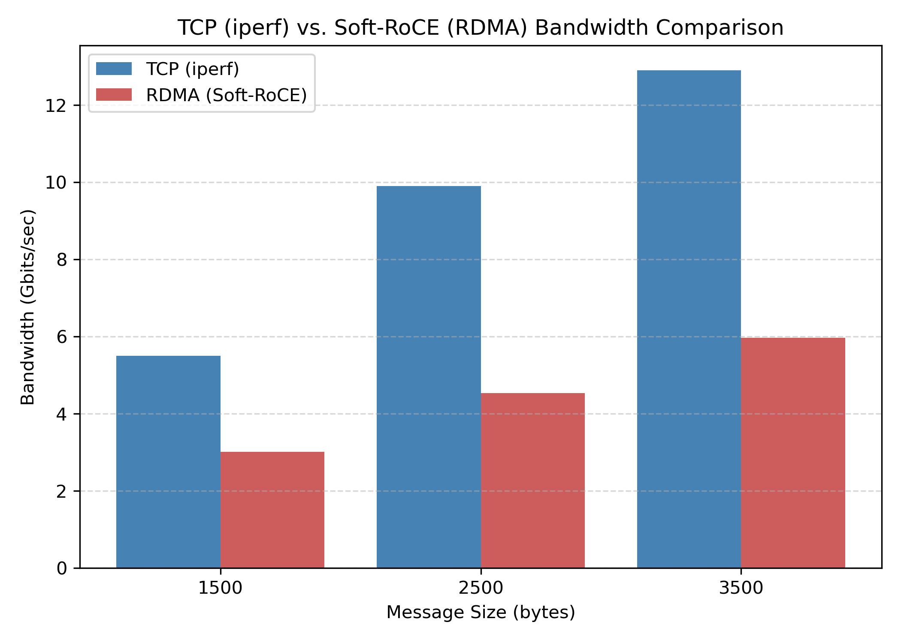

# Bandwidth Analysis

Here, we compare two different approaches to benchmark bandwidth: **RDMA (via Soft-RoCE)**, which is generally optimized for low latency and **TCP-based methods**, which typically focus on bulk throughput. Both measure network performance but are built on different design philosophies and priorities. As a result, drawing meaningful comparisons between RDMA and TCP—much like comparing a sprinter, built for low-latency, high-speed transfers, to a marathon runner, designed for long, sustained data transfers—can be difficult. Each excels in distinct areas, and different tests will show different strengths.

This represents just one configuration among many possible setups, it’s important to consider the context when interpreting these numbers. Even so, this provides a starting point for understanding some of the trade-offs.

> **Note on Latency**  
> For more information on **how RDMA (Soft-RoCE) compares to ICMP** in terms of **latency**, see the [**Latency Analysis**](../latency/analysis.md). While this page focuses on **bandwidth benchmarks**, the latency page demonstrates Soft-RoCE strength in **rapid, low-overhead communication**—especially for smaller message sizes.
> 
> **For details on the system model, NIC, and switch used in these tests, see the [Benchmarking Instructions](../../container-setup/benchmark_instructions.md)**

## Test Parameters and Methodology

In our setup, `ib_send_bw` uses fixed message sizes of **1,500**, **2,500**, or **3,500** bytes. For consistency in TCP testing, we use `iperf3` with the same buffer lengths (e.g., `iperf3 -c <server_ip> -l 1500`). Although this helps match message sizes, differences in overhead (e.g, error-checking vs. zero-copy), concurrency settings (e.g, single vs. multiple streams), or protocol features (e.g, reliability vs. direct memory access) can still complicate direct comparisons between `ib_send_bw` and `iperf3`.

## MTU Considerations

Soft-RoCE is capped at a **~4096-byte MTU**, despite underlying Ethernet MTU supporting Jumbo Frames (9,000 bytes). In contrast, TCP/IP can take full advantage of Jumbo Frames, which often improves bulk data transfer rates. Since our largest message size is 3,500 bytes, we stay under the 4,096-byte MTU cap, and fragmentation isn't a concern.

## Soft-RoCE vs TCP 

Here, `iperf3` achieves higher bandwidth across all three message sizes.

> **Note: These numbers exceed 1 Gbps because this traffic primarily traverses an in-memory virtual bridge on a single host. See [Why the Results Exceed 1 Gbps](#why-the-results-exceed-1gbps) below for more details.** 

## Insights, Recommendations, and Limitations

### Trade-offs Between RDMA (Soft-RoCE) and TCP (`iperf3`)
At a high level, the core differences lie in protocol overhead, MTU limitations, and how each tool measures performance. Soft-RoCE, as a software-based RDMA implementation, significantly reduces overhead for small- to medium-sized messages, but can struggle to match TCP’s bulk throughput due to a 4096-byte MTU cap and added software overhead. Meanwhile, TCP (`iperf3`) can leverage jumbo frames (up to 9 KB) and congestion control mechanisms, which help sustain higher bandwidth over on larger transfers.

### Recommendations for Fairer Comparisons
The ideal benchmark scenario tries to eliminate every variable except those intrinsic to the protocols themselves—things like how RDMA bypasses the kernel or how TCP implements retransmissions. In practice, it's quite diffcult to make `ib_send_bw` and `iperf3` behave identically because they are built on fundamentally different protocol stacks. Nonetheless, there’s still plenty of room to improve test consistency and relevance by identifying and controlling for confounding variables. Aligning test settings like message sizes, durations, and buffer configurations support a fairer comparison. Likewise, minimizing external variability, such as running tests on idle networks, pinning processes to specific CPU cores, and using warm-up phases to let each protocol stabilize, also helps consistency. 

### Limitations and Observations
These tests, conducted in a single Proxmox environment with Soft-RoCE, fall far short of capturing all potential use cases (e.g., large clusters, hardware-accelerated RDMA NICs, etc). Even so, we can see the trade-offs between low-latency RDMA and high-throughput TCP—particularly for medium-sized messages (1,500–3,500 bytes). 

In this setup, the 4,096-byte MTU limit and software overhead of Soft-RoCE place it at a disadvantage in raw bandwidth comparisons with `iperf3`. However, if you switch to examining latency or small-message rates, you may see Soft-RoCE’s strengths more clearly.

> **Why the Results Exceed 1 Gbps**  
> Although the physical NIC on this host is rated at 1 Gbps, the server and client both run on the same machine where much of the “network” traffic flows through a virtual bridge in RAM rather than over the physical wire. Therefore, **TCP (iperf)** can show "multi-gigabit" throughput by effectively copying data in memory through virtual interfaces, and **Soft-RoCE (ib_send_bw)** can similarly report speeds above 1 Gbps. If you ran these benchmarks between two genuinely separate hosts, you’d expect results closer to the actual line rate.
