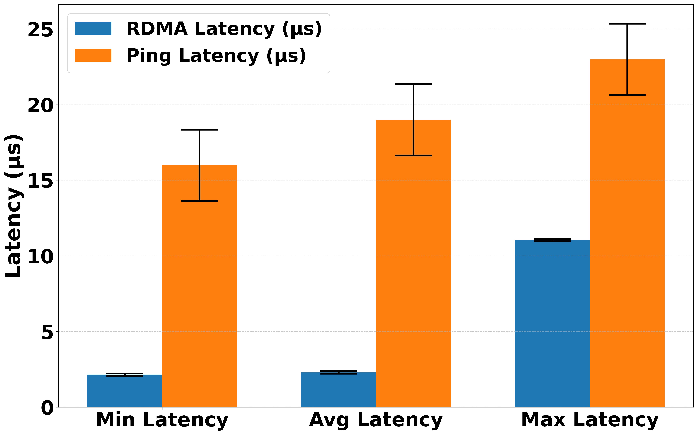
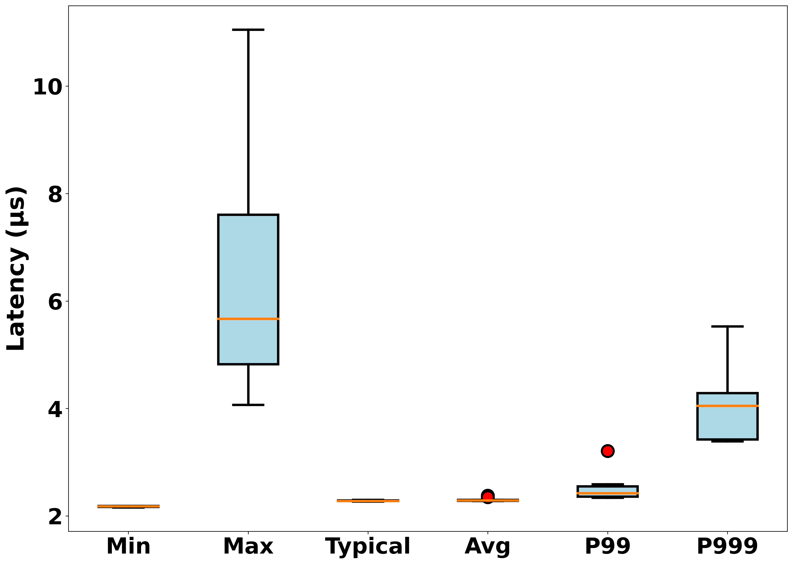

# Latency Analysis

This page compares latency measurements from **RDMA** benchmarks with traditional **ping (ICMP)** tests. The results presented here are specific to a Proxmox container setup using Soft-RoCE with a particular configuration. Performance in other scenarios will vary depending on factors like hardware, network conditions, and workload profiles. These results represent just one of many possible configurations. 

> **For a focus on throughput,** visit the [**Bandwidth Analysis**](../bandwidth/analysis.md) page, where Soft-RoCE and TCP-based methods are compared under different message sizes.
> 
> **For details on the system model, NIC, and switch used in these tests, see the [Benchmarking Instructions](../../container-setup/benchmark_instructions.md)**

## Soft-RoCE & Ping (ICMP)

**Soft-RoCE**, a software-based RDMA implementation over standard Ethernet NICs, doesn't match the performance of hardware-based RDMA. However, it can still provide latency improvements over traditional TCP/IP-based communication by bypassing parts of the kernel networking stack to reduce overhead.

**Ping (ICMP)** measures basic network connectivity (round-trip time) and relies on the full TCP/IP stack. The extra overhead often leads higher latency compared to RDMA paths. 

**Workflow Paths**
<table>
  <tr>
    <th style="text-align:center;">TCP Path</th>
    <th style="text-align:center;">RDMA Path</th>
  </tr>
  <tr>
    <td>
<pre>
┌───────────────┐
|   Application |
└───────────────┘
       ↓
   [TCP Layer]
       ↓
    [IP Layer]
       ↓
 [Ethernet Layer]
       ↓
     [Network]
       ↓
 [Ethernet Layer]
       ↓
    [IP Layer]
       ↓
   [TCP Layer]
       ↓
┌───────────────┐
|   Application |
└───────────────┘
</pre>
    </td>
    <td>
<pre>
┌─────────────────────┐
|   RDMA Application  |
└─────────────────────┘
          ↓
[RDMA Driver/Soft-RoCE]
          ↓
       [Network]
          ↓
[RDMA Driver/Soft-RoCE]
          ↓
┌─────────────────────┐
|   RDMA Application  |
└─────────────────────┘
</pre>
    </td>
  </tr>
</table>

> **Note:** In RoCE v2, RDMA packets travel inside UDP/IP frames over Ethernet from the network’s perspective. However, from the application’s point of view, the usual TCP layer is skipped, and data is sent directly via RDMA verbs.

## Soft-RoCE vs. Ping (ICMP)

These results are based on small-scale, controlled 64-byte packet measurements and demonstrate the potential for significantly lower latencies with **Soft-RoCE** compared to **ping (ICMP)**. 

Below are two visualizations: a bar chart comparing Soft-RoCE and ping latencies, and a box plot illustrating Soft-RoCE’s latency distribution.

| **Latency Bar Chart (Soft-RoCE vs. Ping (ICMP))**                                           | **Soft-RoCE Latency Distribution (Box Plot)**                                            |
|:-------------------------------------------------------------------------------------:|:-----------------------------------------------------------------------------------------:|
|  |        |

These figures provide visual snapshots of Soft-RoCE's lower average latencies and tighter distribution than ICMP ping, with occasional outliers still remaining below ICMP latencies.

## 4. Insights and Pitfalls 

Soft-RoCE is inherently limited without specialized RDMA NIC hardware, which impacts both latency and CPU utilization, as more packet processing is handled by the host CPU rather than offloaded to dedicated hardware. Beyond Soft-RoCE itself, factors like the Ethernet NIC quality, RoCE and Proxmox configurations, and broader system conditions also play a role in the results. 

The tests here focused on small (64-byte) messages under minimal load, which may not fully represent larger message sizes, varied traffic patterns, or more demanding workloads. For a fuller picture, additional metrics like throughput, and CPU usage should be incorporated.

Despite these limitations, in this specific Proxmox container environment, Soft-RoCE demonstrated lower and more predictable latency than ICMP ping. These initial observations can serve as a starting point for exploring software-based RDMA where fully hardware-accelerated solutions are not available. However, further configuration tuning and larger-scale testing remain necessary before drawing any broader or more definitive conclusions.
